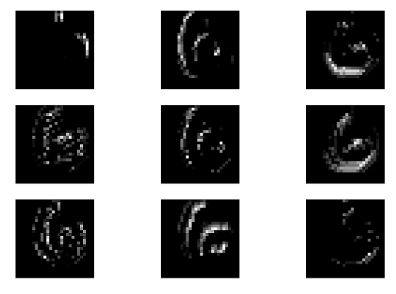

## Convolutional Neural Network for Image Recognition
## MNIST Digit Recognition:
### Network Architecture
- Input -->Block1[Conv1 -->Relu --> Pool1]-->Block2[Conv2 -->Relu --> Pool2]-->Block3[Conv3 -->Relu --> Pool3]-->Block4 -->[FC1--Relu] >Block5[FC2 --> Relu]-->Softmax
- Learning rate = 0.00010.0001

- Epochs = 100
- Minibatch size = 16
- Cost of training data after epoch 95: 0.016345
- Train Accuracy: 0.999059999999965
- Validation Accuracy: 0.9814
- Test Accuracy: 0.9835
- Learning Curve

- Showing correctly classified and miss classified Images

- Displaying feature maps of Digit 6

- Histogram of Output layer weights before and after L2 Regularizaation

- Effect of L2 Regularization: 

